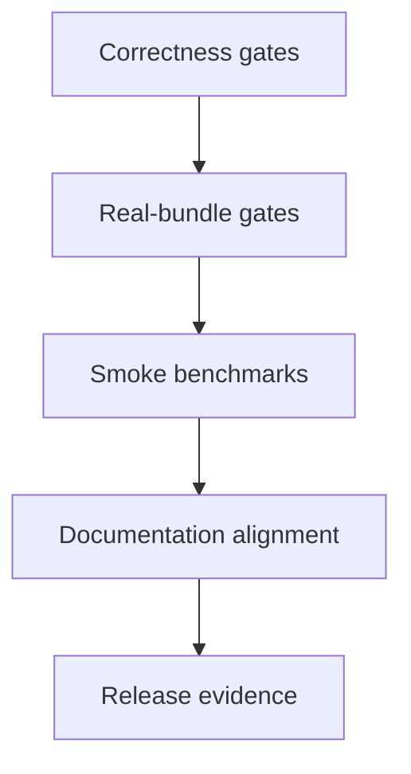

# Production Readiness Evidence - 2026-05-05

This note records the release-readiness evidence collected for the current
P1/P0 correctness diff.

## Run Metadata

| Field | Value |
|---|---|
| Date | 2026-05-05 23:22 JST |
| Base commit | `e4ed40bf` |
| Host | macOS, Apple Silicon |
| Build mode | `xcodebuild build-for-testing`, then `test-without-building` one suite or case at a time |
| Probe build | `OTHER_SWIFT_FLAGS='$(inherited) -DENABLE_METAL_PROBES'` for probe-only MetalCompiler tests |
| Log location | `/tmp/swift-lm-pr-*.log` |

## Model Inputs

| Model | Local path used by evidence |
|---|---|
| Qwen3.5 0.8B | `/Users/1amageek/.cache/huggingface/hub/models--Qwen--Qwen3.5-0.8B/snapshots/2fc06364715b967f1860aea9cf38778875588b17` |
| LFM2.5 1.2B Thinking | `/Users/1amageek/.cache/huggingface/hub/models--LiquidAI--LFM2.5-1.2B-Thinking/snapshots/95053d21d8e0b7ca99421a2127ae39c64f685ff3` |
| Gemma4 E2B IT | `/Users/1amageek/.cache/huggingface/hub/models--google--gemma-4-E2B-it/snapshots/b4a601102c3d45e2b7b50e2057a6d5ec8ed4adcf` |

## Correctness Gates

| Suite | Status | Notes |
|---|---:|---|
| `ModelsTests/ModelDeclarationTests` | done | 46 tests passed |
| `MetalCompilerTests/QuantizationPlanningTests` | done | 9 tests passed; expectations match the current planner contract |
| `MetalCompilerTests/AttentionSequenceEquivalenceTests` | done | sequence attention equivalence passed |
| `MetalCompilerTests/BarrierOptimizationTests` | done | barrier optimizer contract passed |
| `MetalCompilerTests/PrefillTransferTests` | done | prefill transfer contracts passed |
| `MetalCompilerTests/ReferenceComparisonTests` | done | release gate passed; final-norm diagnostic skip is not counted as pass evidence |
| `MetalCompilerTests/ReferenceComparisonIsolatedDiagnosticsTests` | done | decode-step isolation diagnostic passed |
| `MetalCompilerTests/Qwen35PromptIngestionTests` | done | BF16 Qwen sequence prefill trace gate passed with Metal probes enabled |

## Real-Bundle Gates

| Suite | Status | Notes |
|---|---:|---|
| `SwiftLMTests/RealOutputEvidenceTests` | done | Qwen, LFM, and Gemma4 strict capital prompts returned Tokyo-aligned outputs |
| `SwiftLMTests/ReleaseSmokeOutputTests` | done | LFM output and thinking-chat smoke passed |
| `SwiftLMTests/ReleaseSmokePromptStateTests` | done | direct and restored prompt-state sampling matched |
| `SwiftLMTests/ReleaseSmokeCapabilityTests` | done | unsupported multimodal input failed explicitly |
| `SwiftLMTests/RotorQuantRealBundleBaselineTests` | done | Gemma4 FP16 baseline real-bundle gate passed |
| `SwiftLMTests/RotorQuantRealBundleFullTests` | done | Gemma4 RotorQuant real-bundle full-policy gate passed |
| Qwen vision synthetic suites | done | capability, prompt processor, execution layout, runtime, and integration suites passed |
| Qwen vision real-bundle suites | done | text, image, video, mixed, and prompt-state suites passed |
| `SwiftLMTests/Gemma4RealBundleTests` | done | local Gemma4 strict capital prompt returned `Tokyo` |
| Text embedding runtime/isolation suites | done | runtime and context isolation suites passed |
| `SwiftLMTests/EmbeddingGemmaRealBundleTests` | done | real EmbeddingGemma normalized embedding smoke passed |
| `SwiftLMTests/EmbeddingGemmaReferenceParityTests` | partial | skipped because no reference snapshot was configured; this is not pass evidence |

## Smoke Benchmarks

Benchmark evidence was collected only after correctness gates passed or were
explicitly marked partial.

| Suite or case | Status | Notes |
|---|---:|---|
| `MetalCompilerTests/BenchmarkDiagnosticsTests` | done | 15 tests passed |
| `MetalCompilerTests/RotorQuantCorrectnessTests` | done | 27 tests passed |
| `MetalCompilerTests/RotorQuantBenchmarkTests` | done | full suite exceeded 120 seconds, so every case was run individually |
| `RotorQuantBenchmarkTests/gemma4ThroughputVsContextLength()` | done | workload reduced to two fill levels and one iteration for release smoke |
| `SwiftLMTests/GenerationThroughputBenchmarkTests` | done | 2 tests passed |
| `GenerationScalingBenchmarkTests/requestLevelScaling50()` | done | individual case passed |
| `GenerationScalingBenchmarkTests/requestLevelScaling128()` | done | individual case passed |
| `GenerationScalingBenchmarkTests/requestLevelScaling256()` | done | individual case passed |
| `GenerationStreamingBenchmarkTests/streamChunkSizeComparison()` | done | workload reduced to 128 generated tokens, three chunk sizes, one iteration |
| `GenerationStreamingBenchmarkTests/promptStateReuseComparison()` | done | individual case passed |

The original `GenerationScalingBenchmarkTests` and `GenerationStreamingBenchmarkTests`
suite-level invocations exceeded the 120-second outer timeout. They were
treated as benchmark harness sizing issues, not runtime correctness failures,
and were re-run as individual cases.

## Documentation Alignment

| Document | Status | Notes |
|---|---:|---|
| `docs/production-readiness.md` | updated | Qwen BF16 hybrid sequence prefill no longer described as state-buffer gated |
| `docs/design/metal4.md` | updated | hybrid prefill status now points to trace-equivalence gates |
| `docs/benchmarks/qwen3_5-0.8b-mlx-vs-swiftlm.md` | updated | 2026-04-17 Qwen numbers are marked historical; current speed claim remains pending |
| `README.md` | checked | production-readiness link remains consistent |

## Release Status

| Gate | Status | Release interpretation |
|---|---:|---|
| Output correctness | done | Major focused output gates passed |
| Crash and memory behavior | done | Heavy tests were split by suite/case; no unexplained xctest restart remained in the final split runs |
| Performance evidence | done | Smoke benchmarks pass, but Qwen sequence-prefill speed claim is still pending a dedicated re-benchmark |
| API direction | done | No public API changes in this diff |
| Capability reporting | done | Unsupported multimodal/text mismatch path fails explicitly |
| Reference parity assets | partial | EmbeddingGemma reference snapshot is missing and must not be counted as a pass |

Production-ready wording is acceptable for the covered text-generation,
multimodal-preparation, Gemma4, Qwen3.5, LFM, and smoke benchmark gates listed
above. It must exclude EmbeddingGemma reference parity until the missing
snapshot is supplied and the suite produces non-skip pass evidence.
